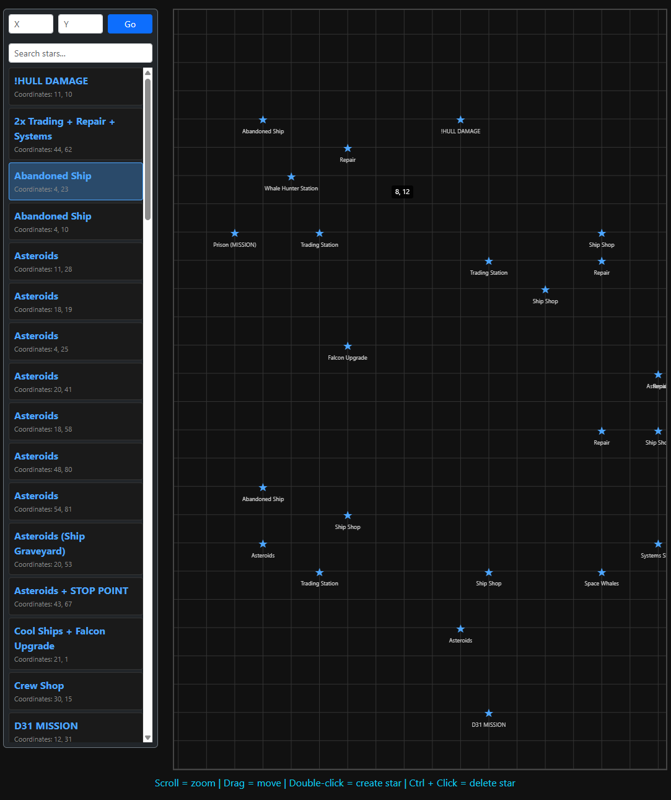

# StarMap

**Simple mapping companion app for the game [Tachyon (itch.io)](https://spektor.itch.io/tachyon)**

A live, searchable mapping tool for Tachyon. 
Map the universe with your friends!
The map refreshes every 5 seconds. 

Map data is saved in a sqlite file for easy use in other programs / portability.



## Usage

By default, StarMap runs on port 80.

- Method 1) Run with Python:
    ```
    python3 -m pip install -r requirements.txt
    python3 run.py
    ```

- Method 2) Build with Docker:
    ```
    docker build -t starmap . && docker run -d \
    -p 80:80 \
    -v ./config:/config \
    -e PYTHONUNBUFFERED=1 \
    --name starmap \
    --hostname starmap \
    --stop-signal SIGINT \
    --restart unless-stopped \
    starmap
    ```

- Method 3) Docker Compose with included compose file:
    ```
    docker compose up starmap
    ```

